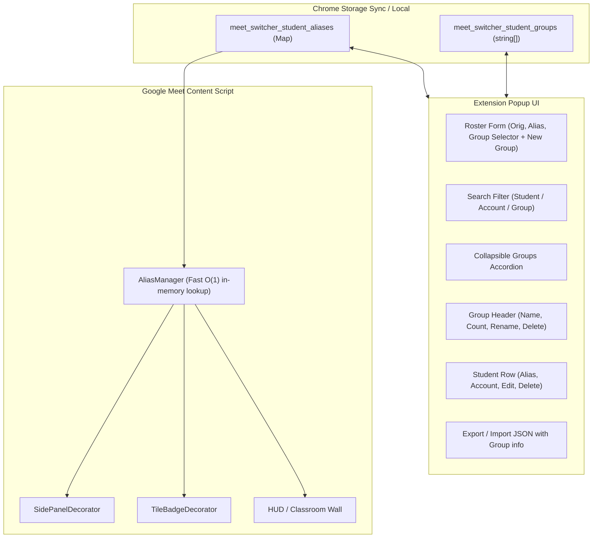

# Design Spec: Internal Student Groups & Roster Management

* **Feature Name**: Internal Student Groups (Внутрішні групи учнів)
* **Target Environment**: Google Chrome (Manifest V3)
* **Date**: 2026-09-18
* **Status**: Approved Design

---

## 1. Problem Statement & Motivation
Teachers frequently instruct multiple distinct student classes, cohorts, or tutoring groups across the week (e.g. *"Python Понеділок 17:00"*, *"5-А клас"*, *"Scratch Субота"*).
Currently, all student nicknames and parent account mappings are stored in a single flat list. As the number of students grows, locating specific children, recalling which student belongs to which class, and managing their aliases becomes difficult.

Teachers need a lightweight, organized system within the extension popup to:
1. Categorize students into distinct groups (one group per student).
2. Filter, search, and navigate students grouped by their classes in collapsible sections (folders).
3. Easily assign and re-assign groups when adding or editing students.
4. Manage groups themselves (create, rename, delete) without losing student data.

---

## 2. Requirements & Scope

### Functional Requirements
1. **Group Membership**:
   - Each student entry can belong to exactly one group (or have no group assigned, falling under "(Без групи)").
   - Backward compatible: All existing saved aliases without a `group` property automatically default to "Без групи".
2. **Group Registry & Management**:
   - Stored in Chrome Storage under `'meet_switcher_student_groups'` as a sorted array of unique group names (`string[]`).
   - Ability to create groups beforehand (even with 0 students).
   - Ability to rename a group: renaming updates the group registry and automatically updates all students assigned to that group.
   - Ability to delete a group: deleting a group removes it from the registry and transitions all its assigned students to "(Без групи)" without deleting the students.
3. **Popup Form & Workflow**:
   - The alias creation/editing card in `popup.html` provides a Group dropdown (`<select>`) containing:
     - `(Без групи)`
     - All created groups
   - Next to the dropdown, an intuitive `➕ Нова група` button opens an inline prompt to quickly create and select a new group.
   - Editing a student populates their current group in the dropdown.
4. **Grouped Accordion View & Instant Search**:
   - The roster list in `popup.html` renders students structured under group headers:
     - `📁 [Назва групи] ([Кількість])` with a toggle icon (`▼` / `►`).
     - Action buttons on group headers: Rename (`✏️`) and Delete (`🗑️`) (except for the built-in "Без групи" section).
   - Under each group header, students are listed with their alias, original account name, and action buttons (`✏️`, `🗑️`).
   - The search input filters by student name, parent account name, or group name. When searching, matching groups automatically expand.
5. **JSON Import & Export**:
   - Export includes the `group` field in each student object.
   - Import safely parses both legacy JSON rosters (assigning missing groups to "Без групи") and new JSON rosters with groups.

### Non-Goals
* No complex multi-group tagging or nested sub-groups (kept simple and fast: 1 student = 1 group).
* No in-call group switching requirement (aliases remain active across all Google Meet calls regardless of the group).
* No external server sync required.

---

## 3. Data Model & Storage

### Storage Keys
* `'meet_switcher_student_aliases'`: `Record<string, StudentAliasEntry>`
* `'meet_switcher_student_groups'`: `string[]`

### Updated Type Definition (`src/types/alias.ts`)
```typescript
export interface StudentAliasEntry {
  /** Normalized lowercase lookup key (e.g., "оксана петренко") */
  key: string;

  /** Original Google Meet display name as detected (e.g., "Оксана Петренко") */
  originalName: string;

  /** Custom student nickname assigned by teacher (e.g., "Максим") */
  alias: string;

  /** Optional group name assigned by teacher (e.g., "5-А клас", "Python Пн 17:00") */
  group?: string;

  /** Timestamp of when the alias was created or last updated */
  updatedAt: number;
}

export type StudentAliasMap = Record<string, StudentAliasEntry>;
```

---

## 4. Architecture & Component Interaction



---

## 5. UI / UX Design in Popup

1. **Form Layout**:
   - Input 1: Original name (`#input-orig-name`)
   - Input 2: Student nickname (`#input-student-name`)
   - Row 3:
     - Group selector dropdown (`#select-group`)
     - Button `➕ Нова група` (`#btn-create-group`)
   - Save / Cancel buttons

2. **Grouped View (Accordion)**:
   - Each group is a card container with:
     - Header:
       - Title: `📁 ${groupName}`
       - Pill: `${count} учнів`
       - Buttons: Rename (`✏️`), Delete (`🗑️`)
       - Chevron (`▼`)
     - Body:
       - `<ul>` list of student items.
   - Default state: Expanded. Teachers can click group headers to collapse/expand.

3. **Empty States**:
   - If a group has 0 students: displays "У цій групі ще немає учнів".
   - If no students exist at all: displays existing global empty state.

---

## 6. Testing & Verification
1. **Unit Tests**:
   - Setting alias with group and verifying stored entry.
   - Renaming group updates all associated student entries.
   - Deleting group updates associated students to `group: undefined`.
   - Exporting and importing JSON with group attributes.
2. **UI & Build Verification**:
   - `npm test` runs cleanly.
   - `npm run typecheck` passes without errors.
   - `npm run build` bundles without issues.
