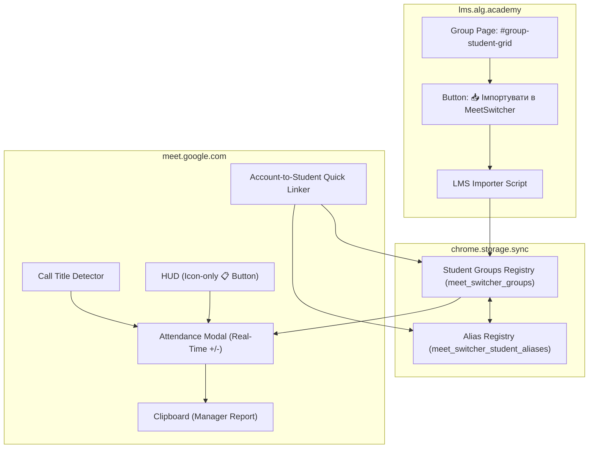

# Design Doc: LMS Group Import & Real-Time Attendance Automation

- **Date:** 2026-09-18
- **Topic:** LMS (`lms.alg.academy`) Group Import, Google Meet Auto-Matching, and Real-Time Attendance Reporting
- **Status:** Approved for Implementation

---

## 1. Overview & Goals

As a teacher conducting online lessons via Google Meet and managing students in the Algoritmika LMS (`lms.alg.academy`), compiling and formatting student attendance reports for managers is currently a manual, error-prone, and time-consuming process.

### Primary Objectives:
1. **1-Click LMS Group Import:** Inject an import button directly on `https://lms.alg.academy/group/view/*#group-student-grid` to extract all student names, LMS IDs, and profile URLs without manual data entry.
2. **Auto-Select Active Group by Meet Call Title:** Detect the Google Meet call title upon joining and automatically select the matching group (with manual fallback).
3. **1-Click Account Pairing in Google Meet:** When unknown/parent Google accounts appear in Meet, allow the teacher to pair the account to an LMS student in one click, automatically creating aliases and linking cards forever.
4. **Real-Time Attendance in HUD:** Provide an icon-only button (`📋`) in the Google Meet HUD opening a compact modal showing live present (`+`) and absent (`-`) indicators.
5. **Manager-Ready Attendance Export:** A single button that copies the report directly to the clipboard in the manager's required format:
   ```text
   Альфелді Камалія (https://lms.alg.academy/student/update/6753930) (Iryna Alfeldi) +
   Воронченко Віра (https://lms.alg.academy/student/update/6753283) (Vira Voronchenko) +
   Євтушенко Ярослав (https://lms.alg.academy/student/update/6751389) (Roman Yevtushenko) -
   ```

---

## 2. Architecture & Components



---

## 3. Data Schema (`src/types/attendance.ts`)

```ts
export interface GroupStudent {
  id: string;                 // LMS Student ID (e.g., "6753930")
  fullName: string;           // Official student name from LMS (e.g., "Альфелді Камалія")
  lmsUrl: string;             // Direct URL (e.g., "https://lms.alg.academy/student/update/6753930")
  meetOriginalName?: string;  // Bound Google Meet account name (e.g., "Iryna Alfeldi")
  shortAlias?: string;        // First name or preferred nickname (e.g., "Камалія")
}

export interface StudentGroup {
  id: string;                 // LMS Group ID from URL (e.g., "2599104")
  name: string;               // Group title from LMS header (e.g., "Python Start 2599104")
  lmsUrl: string;             // Page URL
  students: GroupStudent[];
  updatedAt: number;
}

export type StudentGroupMap = Record<string, StudentGroup>;
```

---

## 4. Component Specifications

### 4.1. LMS Content Script (`src/lms/importer.ts`)
* **Match Target:** `https://lms.alg.academy/group/view/*`
* **Behavior:**
  1. Locates the student grid container (`#group-student-grid`).
  2. Extracts group name from the page title / header.
  3. Extracts student rows (`a[href*="/student/update/"]`):
     - `fullName`: Link text
     - `id`: Regex match from `href` (`/student/update/(\d+)`)
     - `lmsUrl`: Absolute URL `https://lms.alg.academy/student/update/<id>`
  4. Injects an action button: `📥 Імпортувати в MeetSwitcher`.
  5. On click: Merges with existing group data (preserving any already paired `meetOriginalName`), saves to `chrome.storage.sync`, and displays visual feedback `✅ Імпортовано N учнів!`.
* *Note on User Input:* The exact selectors will be finalized using the full HTML snippet provided by the user before coding.

### 4.2. Google Meet Call Title Recognition (`src/content/attendance/title-detector.ts`)
* Observes Google Meet DOM for the active meeting title.
* Normalizes meeting title and fuzzy-matches against stored `StudentGroup.name` or `StudentGroup.id`.
* Emits active group change event when detected.
* *Note on User Input:* Target container selector will be based on the user's provided HTML snippet.

### 4.3. 1-Click Account Pairing (`src/content/attendance/pairing.ts`)
* Integrates with HUD alias editor (`✏️`) and double-click actions on video tiles and the People side panel.
* If a participant in the call does not yet have a paired student:
  - Displays a dropdown of unassigned students from the active group.
  - Selecting a student sets `meetOriginalName` and registers the student's first name as an alias in `AliasManager`.
  - Tile badges and People panel re-render immediately.

### 4.4. HUD Attendance Modal & Copy Export (`src/content/ui/attendance-modal.ts`)
* **HUD Trigger Button:**
  - Placed in `SwitcherHud`.
  - **Icon-only** per user preference: `📋` (with title/tooltip `"Відвідуваність уроку"` and dynamic badge e.g. `7/9`).
* **Modal View:**
  - Header: Active group name + group switcher dropdown.
  - Counters: `🟢 Присутні: X | 🔴 Відсутні: Y`.
  - Student List:
    - Real-time matching: a student is marked `+` if their `meetOriginalName` or `shortAlias` is currently detected in Google Meet's participant registry (`ScreenDetector` / `SidePanelDecorator`).
    - Unmatched students marked `-`.
    - Manual override toggle allowed (clicking `+`/`-` flips status).
* **Export Action («📋 Скопіювати для менеджера»):**
  - Iterates through group students in alphabetical order.
  - Formats each line:
    `{fullName} ({lmsUrl}) ({meetOriginalName || "не прив'язано"}) {status ? '+' : '-'}`
  - Copies to clipboard and shows toast feedback `✓ Скопійовано в буфер обміну!`.

---

## 5. Edge Cases & Resilience

1. **New Students Added in LMS:**
   - Re-clicking `📥 Імпортувати` updates the student roster without erasing existing Meet account links.
2. **Generic Meeting Title:**
   - If Google Meet has a generic code (e.g. `abc-defg-hij`) instead of group title, the HUD modal defaults to the most recently used group and offers a 1-click dropdown to pick the right one.
3. **Student Connected via Different Account / Phone:**
   - The teacher can manually click `+` or `-` on any student row to override presence status for the current session.
4. **Storage Quota:**
   - Synchronized across Chrome instances using `chrome.storage.sync`, falling back gracefully to `chrome.storage.local` if size exceeds 100KB.

---

## 6. Verification & Test Plan

1. **Unit Tests:**
   - LMS link and ID parsing regex tests.
   - Meeting title matching against group names.
   - Attendance list formatter test ensuring exact output format down to every space, parenthesis, and newline.
   - Storage persistence and migration tests.
2. **DOM Integration Tests:**
   - HTML parsing simulation for `#group-student-grid`.
   - Real-time `+` / `-` presence evaluation based on detected call participants.
3. **Build & Typecheck:**
   - `npm run typecheck` (`tsc --noEmit`)
   - `npm test`
   - `npm run build`
